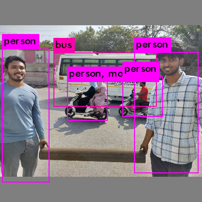

# YOLOv3-Tiny FPGA Implementation on Xilinx ZedBoard

Real-time object detection using YOLOv3-Tiny neural network accelerated on Xilinx ZedBoard FPGA. Achieves **10-19× speedup** over ARM Cortex-A9 software implementation.

---

##  Key Results

| Metric | Value |
|--------|-------|
| **Speedup over ARM CPU** | **10× - 19×** |
| **Inference Time** | 536 ms |
| **FPS** | 1.86 |
| **Power Consumption** | ~2W |
| **Energy per Inference** | 1.07 J |
| **DSP Utilization** | 161/220 (73%) |
| **BRAM Utilization** | 184/280 (66%) |

---

##  Features

- ✅ Complete YOLOv3-Tiny implementation (80 COCO classes)
- ✅ Custom preprocessing pipeline (letterbox, quantization, reordering)
- ✅ HLS-based neural network accelerator IP cores
- ✅ Custom post-processing with Non-Maximum Suppression (NMS)
- ✅ Fast DDR memory dump (10-20× faster than UART)
- ✅ Automated end-to-end pipeline
- ✅ 16-bit fixed-point (Q8.8) quantization
- ✅ 10-19× speedup over ARM Cortex-A9 software implementation

---

## System Architecture

```
┌──────────┐     ┌──────────────┐     ┌──────────────┐     ┌──────────┐
│  Input   │────▶│ Preprocessing│────▶│    FPGA      │────▶│  Post-   │
│  Image   │     │   (Host PC)  │     │  Inference   │     │Processing│
│(768×576) │     │              │     │              │     │          │
└──────────┘     └──────────────┘     └──────────────┘     └──────────┘
                        │                    │                    │
                        ▼                    ▼                    ▼
                 ┌────────────┐       ┌────────────┐       ┌────────────┐
                 │group_0_    │       │ DDR Output │       │predictions │
                 │input.h     │       │            │       │.jpg        │
                 │(416×416×4) │       │            │       │            │
                 └────────────┘       └────────────┘       └────────────┘
```

---

##  Hardware Requirements

| Component | Specification |
|-----------|--------------|
| FPGA Board | Xilinx ZedBoard |
| FPGA Chip | Zynq-7020 (XC7Z020-CLG484) |
| ARM Cores | Dual-core Cortex-A9 @ 667MHz |
| Programmable Logic | 85K Logic Cells, 220 DSP slices |
| Block RAM | 280 × 18Kb BRAM |
| DDR Memory | 512MB DDR3 |

---

##  Detection Result

<p align="center">
  
</p>

---

##  Detectable Objects (80 COCO Classes)

| Category | Objects |
|----------|---------|
| **People** | person |
| **Vehicles** | bicycle, car, motorcycle, airplane, bus, train, truck, boat |
| **Animals** | bird, cat, dog, horse, sheep, cow, elephant, bear, zebra, giraffe |
| **Outdoor** | traffic light, fire hydrant, stop sign, parking meter, bench |
| **Sports** | frisbee, skis, snowboard, sports ball, kite, baseball bat, baseball glove, skateboard, surfboard, tennis racket |
| **Food** | banana, apple, sandwich, orange, broccoli, carrot, hot dog, pizza, donut, cake |
| **Kitchen** | bottle, wine glass, cup, fork, knife, spoon, bowl, microwave, oven, toaster, sink, refrigerator |
| **Furniture** | chair, couch, potted plant, bed, dining table, toilet |
| **Electronics** | tv, laptop, mouse, remote, keyboard, cell phone |
| **Accessories** | backpack, umbrella, handbag, tie, suitcase |
| **Other** | book, clock, vase, scissors, teddy bear, hair drier, toothbrush |

---

##  References

1. Yu, Zhewen and Bouganis, Christos-Savvas. "A Parameterisable FPGA-Tailored Architecture for YOLOv3-Tiny." *Applied Reconfigurable Computing (ARC 2020)*, pages 330-344, Springer, 2020.

2. Redmon, Joseph and Farhadi, Ali. "YOLOv3: An Incremental Improvement." *arXiv preprint arXiv:1804.02767*, 2018.

3. COCO Dataset: [https://cocodataset.org/](https://cocodataset.org/)
